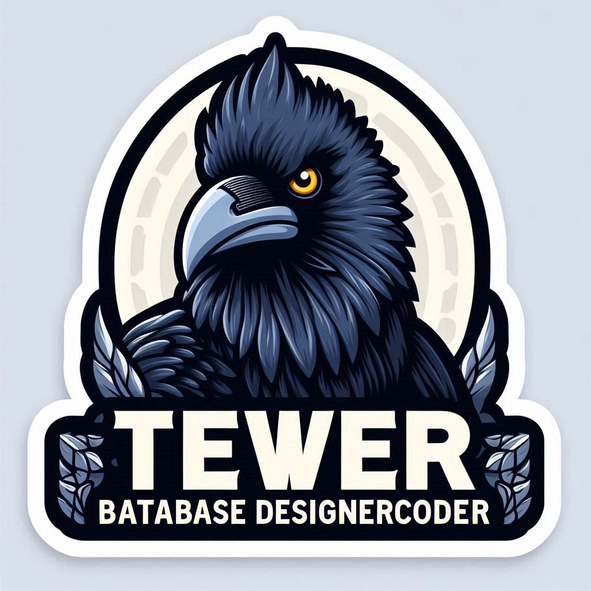

# 🚀 SQLite-MiniServerAdmin (Tewer BataBase | DataBase)

Welcome to **SQLite-Tool-mini**! This is a comprehensive guide to help you get started with our amazing project. Whether you're a developer, contributor, or just curious, you'll find everything you need right here.

## 🌟 Features

- **Execute arbitrary SQLite queries**: Run any SQLite query you need.
- **View table data in a HTML table format**: See your data in an easy-to-read format.
- **Create new tables**: Add new tables to your database.
- **Drop existing tables**: Remove tables you no longer need.
- **Insert new rows**: Add new data to your tables.
- **Sort table data by column**: Organize your data for better analysis.

## 📦 Installation

### Prerequisites

- Ensure you have a compatible version of Python 3.x and SQLite 3.x installed.

### Steps

1. Clone the repository:
   git clone https://github.com/essingen123/SQLite-Tool-mini.git

2. Navigate to the project directory:
   cd SQLite-Tool-mini

3. Run the script using Python:
   python sqlite_tool.py

## 🛠 Usage

1. Open a web browser and navigate to `http://localhost:1025/`
2. Execute queries using the query form or click on the pre-defined buttons
3. View table data by clicking on the table names in the left-hand menu

